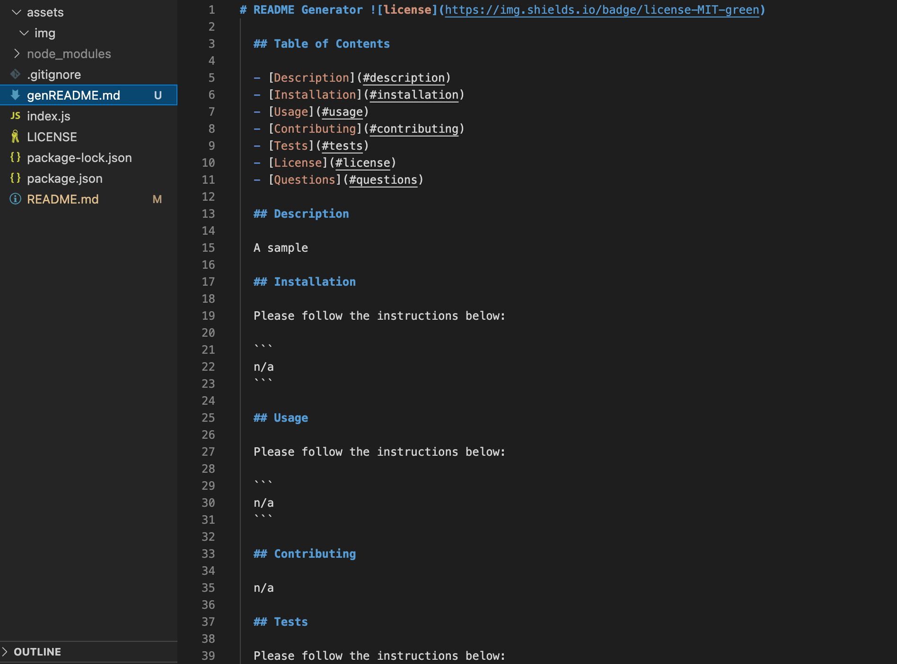

# Professional README Generator

## Description

A professional readme generator which enable users to quickly create a professional README for a new project.

### Installation

```
git clone git@github.com:angelawong3/professional-readme-generator.git
cd professional-readme-generator
npm install
```

### Usage

```
node index.js
or
npm run start
```

### Screenshot and the Walkthrough Video


<br />
Download the walkthrough video [here](https://drive.google.com/file/d/1skEOHK1EUCUA8lZdR4tRrjlJOCQ1-PNL/view?usp=sharing)

### License

[](https://opensource.org/licenses/MIT)

### Contact Me

Please contact me at angelawong3@yahoo.com

---

© 2022 Angela Wong
